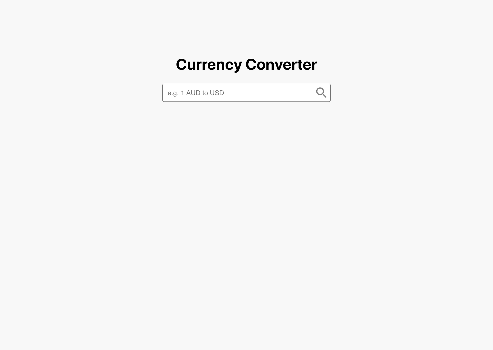

# ps-currency-converter-ts

## 📋 Challenge instructions

- You have been tasked with building a simple currency converter app as per the below Requested features and Screenshots sections.
- You are also welcome to add new features that you believe will enhance the functionality or user experience.
- It may be challenging to complete all the features within the allocated timeframe. We are more interested in the implementation quality of the features you _can_ complete rather than seeing them _all_ complete.

### 🌟 Requested features

1. Display the converted amount based on the exchange rate from the API.
2. Display errors related to user input or from the exchange rate API.
3. Support case insensitive user input.
4. Swap the converted amount, e.g EUR-to-USD can be swapped to USD-to-EUR via the up-down arrows button.
5. Display a history of previous converted amounts with no fixed limit on the number of items.
6. Delete previous converted amounts.
7. Add pagination for long lists of previous converted amounts.

### 🔧 Implementation notes

- The foundations of the app and a recommended exchange rate API integration are provided for you.
- You can reuse what is already there or start from scratch.
- You are also free to use third party packages as needed.
- The UI need not be pixel perfect. Near enough is good enough.

## 📥 How to submit the challenge

1. Clone this repo into your publicly accessible git profile.
2. Raise a Pull Request (PR) with your solution.
    - We encourage you to use git appropriately, e.g. commit regularly.

## 🖼 Screenshots

_⚠️ AUD as a base currency is only for illustration purposes. The recommended exchange rates API limits the base currency to EUR only._

---

## 🔢 Getting started

1. Clone the repo and run `npm install`
2. Start the app via `npm start`
3. Sign up for a free API key at https://apilayer.com/marketplace/exchangerates_data-api and attach it to the fetch requests

_⚠️ Be careful not to expose your API key in publicly visible git repositories._

_⚠️ If you run out of API requests during development you can create another account using a different email._

## ⌨️ Available scripts

In the project directory, you can run:

### `npm start`

Runs the app in the development mode.
Open [http://localhost:3000](http://localhost:3000) to view it in the browser.

The page will reload if you make edits.

### `npm test`

Launches the test runner in the interactive watch mode.
See the section about [running tests](https://facebook.github.io/create-react-app/docs/running-tests) for more information.